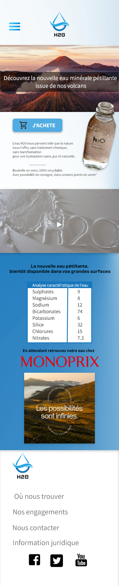
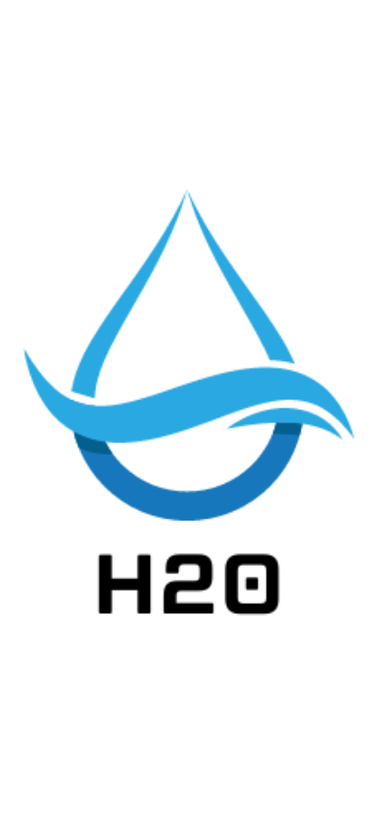

Readme 

##H2o

# Description : 
Dans le cadre de la formation Access Code school nous avons eu un exercice de design.

La consigne était de créer un maquette de site internet de e-commerce parmis 3 produits.
J'ai donc choisi de créer une landing page sur l'eau.

# Preview

